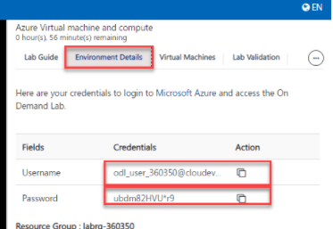

# Getting Started
## Log-in to the Azure Portal

1. In the virtual machine provided on the left side, open a new browser window and sign in to the **Azure Portal**.

1. Use the azure credentials provided in the **Environment Details** tab to log in to the portal.

